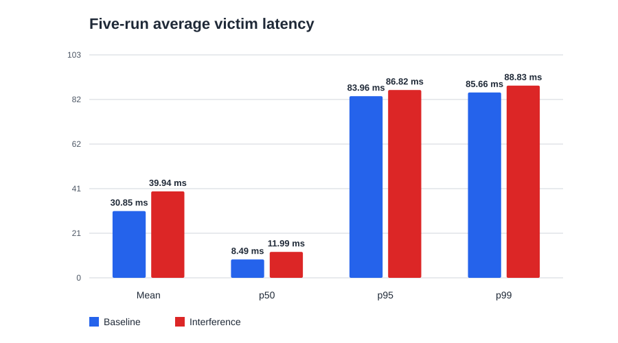
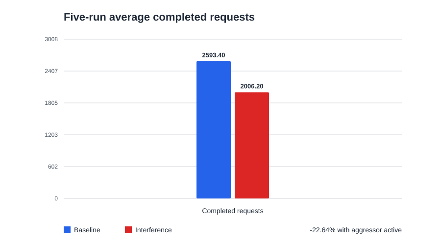

# CacheWarden

CacheWarden is an experimental systems-performance project that studies noisy-neighbor interference between containerized workloads sharing hardware.

## Current status

CacheWarden currently provides an **interference lab**, not a production observability or remediation system. It implements a Go HTTP victim workload, a configurable Go aggressor workload, a concurrent Go HTTP load generator, Docker Compose configuration, an automated baseline-versus-interference benchmark, CSV latency output, summary statistics, tests, and CI-oriented build checks.

It does **not** currently implement eBPF telemetry, automatic noisy-neighbor detection, cache-contention diagnosis, Kubernetes integration, anomaly detection, AI reporting, or remediation.

## Key experimental finding

Across five controlled runs, enabling the aggressor increased mean victim latency by approximately 29% and reduced completed requests by approximately 23%, while preliminary container-level observations showed similar victim CPU and memory utilization.

These experiments establish repeatable interference, not its root cause.

## Architecture

```text
                         GET /work
  tools/loadgen  ---------------------------->  victim
       |                                         |
       | writes latency CSV                      | scans a fixed in-memory data set
       v                                         v
    results/                              Prometheus /metrics

  aggressor (opt-in)  ---> sequential read/write pressure on shared memory hardware
```

The independent Go modules are coordinated by [`go.work`](go.work):

- `victim` exposes `/health`, `/work`, and `/metrics`.
- `aggressor` allocates a bounded buffer and runs sequential read/write workers.
- `tools/loadgen` records individual request results as CSV and reports mean, p50, p95, and p99 latency.

Architecture decisions are recorded in [`docs/adr`](docs/adr/README.md).

## Quick start

From the repository root:

```bash
make test
make run-victim
```

In a second terminal:

```bash
curl http://127.0.0.1:8080/health
curl http://127.0.0.1:8080/work
curl http://127.0.0.1:8080/metrics
```

Stop the foreground victim with `Ctrl+C`.

## Requirements

Local development requires Go 1.22+, GNU Make, Bash, and `curl`. Container experiments additionally require Docker Engine or Docker Desktop and Docker Compose v2. No external HTTP load generator is required.

To build and check every Go module:

```bash
make build
make test
make lint
make race
```

For container operation:

```bash
# Victim only
docker compose up --build victim

# Victim plus the opt-in aggressor
docker compose --profile interference up --build

docker compose --profile interference down --remove-orphans
```

The Compose services define CPU and memory limits. Runtime support for these settings varies; inspect the effective container configuration before relying on it, and do not treat Compose limits as Kubernetes resource guarantees.

## Workload configuration

Both programs accept command-line flags that override environment variables. Run `go run ./cmd/victim --help` inside `victim`, or `go run ./cmd/aggressor --help` inside `aggressor`, for the complete flag list.

| Victim environment variable | Default | Purpose |
| --- | ---: | --- |
| `VICTIM_LISTEN_ADDRESS` | `:8080` | HTTP listen address |
| `VICTIM_WORKLOAD_SIZE` | `32MiB` | Preallocated data-set size |
| `VICTIM_WORKLOAD_ITERATIONS` | `2` | Full scans per `/work` request |
| `VICTIM_SHUTDOWN_TIMEOUT` | `10s` | Graceful shutdown deadline |

| Aggressor environment variable | Default | Purpose |
| --- | ---: | --- |
| `AGGRESSOR_MODE` | `low` | `low`, `medium`, or `high` duty cycle |
| `AGGRESSOR_MEMORY` | `128MiB` | Total buffer size |
| `AGGRESSOR_WORKERS` | at most `2` | Concurrent memory workers |
| `AGGRESSOR_REPORT_INTERVAL` | `5s` | Throughput log interval |

For a deliberate local interference run:

```bash
AGGRESSOR_MODE=medium AGGRESSOR_MEMORY=256MiB make run-aggressor
```

## Reproducing the benchmark

Run:

```bash
make benchmark
```

The script checks prerequisites, starts the victim alone, records baseline traffic, enables the aggressor, records comparable interference traffic, and then removes its containers. Defaults are 20 seconds per phase with concurrency 4. The benchmark uses host port `18080` by default to avoid a local victim conflict.

```bash
BENCHMARK_DURATION=30s BENCHMARK_CONCURRENCY=8 make benchmark
```

Each run writes timestamped files without overwriting existing output:

```text
results/<timestamp>-baseline.csv
results/<timestamp>-interference.csv
results/<timestamp>-summary.txt
```

CSV rows contain a UTC start time, status code, latency in milliseconds, and any request error. The summary includes request totals, failures, mean, p50, p95, p99, and selected percentage changes.

## Experimental results

The reference dataset in [`docs/data/five-run-benchmark.csv`](docs/data/five-run-benchmark.csv) contains five independent runs using the same victim configuration, 20-second phases, concurrency 4, and zero failed requests. Baseline runs the victim without the aggressor; interference enables it.





| Run | Baseline requests | Interference requests | Baseline mean (ms) | Interference mean (ms) | Baseline p50 (ms) | Interference p50 (ms) | Baseline p95 (ms) | Interference p95 (ms) | Baseline p99 (ms) | Interference p99 (ms) |
| --- | ---: | ---: | ---: | ---: | ---: | ---: | ---: | ---: | ---: | ---: |
| 1 | 2,491 | 1,815 | 32.098 | 43.961 | 8.870 | 13.587 | 84.201 | 88.550 | 85.921 | 90.926 |
| 2 | 2,726 | 2,123 | 29.264 | 37.660 | 8.021 | 11.326 | 83.657 | 85.883 | 85.215 | 87.357 |
| 3 | 2,674 | 2,094 | 29.891 | 38.069 | 8.194 | 11.281 | 83.754 | 86.199 | 85.260 | 87.662 |
| 4 | 2,442 | 1,950 | 32.648 | 40.992 | 9.022 | 12.239 | 84.403 | 87.224 | 86.527 | 90.203 |
| 5 | 2,634 | 2,049 | 30.350 | 39.014 | 8.338 | 11.517 | 83.797 | 86.221 | 85.380 | 88.001 |

| Five-run average | Baseline | Interference | Change |
| --- | ---: | ---: | ---: |
| Mean latency | 30.85 ms | 39.94 ms | +29.42% |
| p50 latency | 8.49 ms | 11.99 ms | +41.17% |
| p95 latency | 83.96 ms | 86.82 ms | +3.40% |
| p99 latency | 85.66 ms | 88.83 ms | +3.69% |
| Completed requests | 2,593 | 2,006 | -22.66% |

All five runs had the same qualitative direction: latency increased and completed request count decreased. Failures were zero. These host- and configuration-specific measurements demonstrate repeatable degradation when the aggressor is active; they do not establish LLC/cache contention, memory-bandwidth saturation, or another single cause.

Regenerate the committed charts with only the Python standard library:

```bash
python3 tools/plot_results.py
```

## Preliminary system-level investigation

### Conventional container metrics

A preliminary `docker stats` observation recorded the following approximate snapshots:

| Phase / container | CPU | Memory |
| --- | ---: | ---: |
| Baseline victim | 103.58% | 40.28 MiB / 256 MiB |
| Interference victim | 104.11% | 41.15 MiB / 256 MiB |
| Aggressor during interference | 205.15% | 260.6 MiB / 512 MiB |

In this preliminary observation, victim application performance degraded while its conventional CPU and memory utilization remained broadly similar. This motivates investigation below ordinary container-level resource metrics. These snapshots are not rigorous proof, and Docker metrics remain useful inputs to an investigation.

### PMU / `perf` investigation

A recent paired manual `perf` experiment produced the following measurements:

| Metric | Baseline | Interference | Approximate change |
| --- | ---: | ---: | ---: |
| task-clock | 9,979.85 ms | 9,994.61 ms | essentially unchanged |
| cycles | 41,526,308,835 | 37,582,130,258 | -9.5% |
| instructions | 119,969,148,554 | 102,537,856,119 | -14.5% |
| IPC | 2.89 | 2.73 | -5.6% |
| APERF / MPERF estimated frequency | 4.19 GHz | 3.78 GHz | -9.6% |

The frequency estimate uses APERF/MPERF and a 2.30 GHz nominal/base frequency; cycles per task-clock were approximately 4.16 GHz in the baseline. The victim received approximately the same CPU execution time in this paired run, so this measurement does not support simple scheduling starvation. The aggressor coincided with lower effective core frequency and a modest reduction in instructions retired per cycle.

This is preliminary evidence, not a proven root cause. The working hypotheses include frequency/turbo/power sharing, cache/LLC interference, memory-subsystem contention, and other shared-hardware effects.

## Metrics and observability available today

`GET /metrics` exposes Prometheus text metrics:

- `cachewarden_http_requests_total`
- `cachewarden_http_request_duration_seconds`
- `cachewarden_work_duration_seconds`
- `cachewarden_http_errors_total`
- `cachewarden_http_active_requests`

Prometheus is not bundled; an existing instance can scrape the victim if time-series collection is needed. The benchmark additionally provides request-level CSV latency data and summary percentiles. PMU collection is currently a manual investigation, not an integrated telemetry feature.

## Limitations

- The workloads are synthetic and results are host- and configuration-specific.
- Scheduler placement, NUMA topology, caches, memory channels, frequency scaling, thermal state, and background activity are not controlled by this experiment.
- The benchmark is closed-loop concurrency, not a fixed-rate arrival model.
- Process-local metrics reset on restart, and container resource controls vary by runtime and platform.
- One measurement series cannot distinguish among the current root-cause hypotheses.

## Current investigation and roadmap

1. Establish reproducible interference — completed.
2. Characterize conventional container resource metrics — preliminary and in progress.
3. Diagnose shared-hardware behavior with appropriate Linux and PMU telemetry — in progress.
4. Automate collection of telemetry shown to be useful.
5. Evaluate whether eBPF or cgroup integration improves attribution.
6. Evaluate detection and mitigation only after the signals are understood.
7. Validate any justified final approach in container and Kubernetes scenarios.

eBPF, Kubernetes integration, and remediation remain possible directions, rather than implemented features or committed prerequisites.

## Safety

The aggressor is a controlled experiment workload, not a denial-of-service or general-purpose stress-testing tool. Defaults are conservative; invalid modes, worker counts, and allocations above 1 GiB are rejected, and Linux additionally rejects requests above half of `MemAvailable`. The Compose aggressor has a 512 MiB memory limit and a 2.0 CPU limit, and is absent from the default profile.

Run experiments only on systems you own or are authorized to test. Avoid production nodes, shared development hosts, or systems already under memory pressure. OOM termination remains possible when runtime overhead and the configured buffer reach the effective limit.

## License

CacheWarden is available under the [MIT License](LICENSE).
